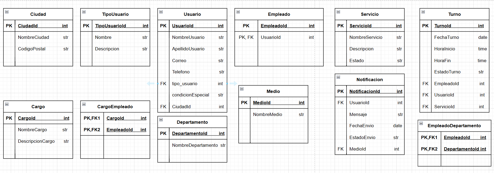

# Primer-parcial---Practica
Desarrollo de la práctica del parcial 1 de Bases de Datos.   Autor: José David Vanegas Martínez - Código 202060558

# Sistema de Turnos LiMar
Este proyecto implementa un sistema de gestión de turnos utilizando contenedores PostgreSQL y pgAdmin. 
Las instrucciones DDL para crear las tablas y DML para poblarlas con datos de prueba.

# Requisitos previos
-Docker instalado
-Imagen oficial de PostgreSQL
-Imagen oficial de pgAdmin

# Despliegue con Docker
-docker run --rm -e POSTGRES_USER=ulimar -e POSTGRES_PASSWORD=ex4men_db -p 5432:5432 postgres:14 (Contenedor postgres)
-docker run --rm -e PGADMIN_DEFAULT_EMAIL=usuario@servilimar.com -e PGADMIN_DEFAULT_PASSWORD=limar#123 -p 5050:80 dpage/pgadmin4 (Contenedor pgadmin)

# Creacion de la base de datos
CREATE DATABASE servilimar;

# Instrucciones DDL y DML
psql -U ulimar -d servilimar -f ddl/estructura.sql
psql -U ulimar -d servilimar -f dml/datos.sql

## Diagramas

### Modelo Relacional

## Autor
Jose Vanegas
